# 1. Explore the spectrum with SDR++

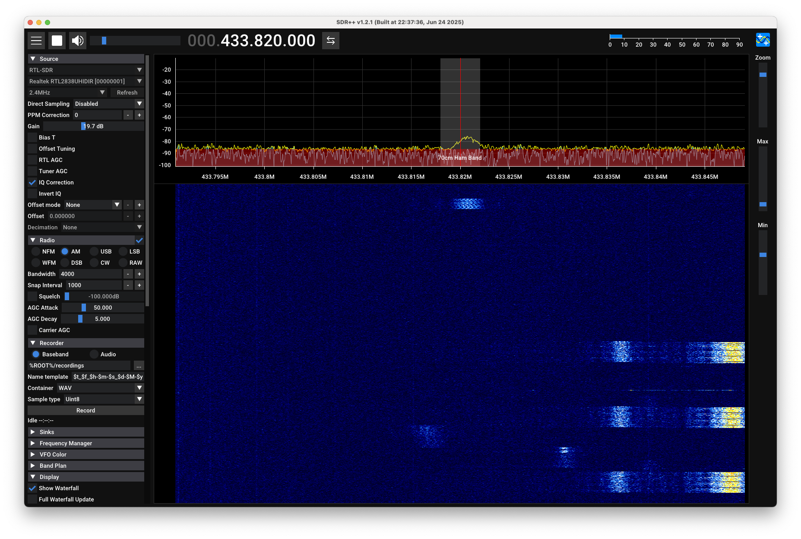

SDR++ is one of the best SDR applications available to me. It is really user-friendly and feature rich.

I generally use SDR++ to explore the radio spectrum and find interesting signals.

It also allows you to listen to cleartext AM/FM signals, which is always fun.

# 2. Recording a signal

> **TLDR**: *Do not record the signal with SDR++. Instead, use `rtl_sdr` to record the IQ data.*


After finding an interesting signal, I usually want to record it for further analysis.
SDR++ allows you to record the bandwidth of the signal you are interested in in a WAV file.
However, for proper signal analysis, I prefer to record the original IQ data. IQ data preserves all the signal information needed for digital signal processing.

While SDR++ can record the entire baseband spectrum, working with these large files can be challenging for targeted analysis. For more focused signal investigation, specialized tools like `rtl_sdr` or `rtl_433` are often more handy.

Both tools are capable of recording raw IQ data directly from RTL-SDR devices. The real difference for our purpose lies in how they handle the recorded data.

## 2.1. Using `rtl_sdr` to record IQ data

To record the IQ data with `rtl_sdr`, you can use the following command:

```bash
rtl_sdr -f 433.92M -s 2M -g 20 output.complex16u
```
where:
- `-f 433.92M` specifies the frequency of the signal you want to record (in this case, 433.92 MHz)
- `-s 2M` sets the sample rate to 2 MHz, which determines how many samples per second are captured
- `-g 20` sets the gain to 20 dB, which amplifies the signal for better reception
- `output.complex16u` is the name of the output file where the IQ data will be saved

The gain especially is one of the parameters you can play with in SDR++ before recording the signal. It can significantly affect the quality of the recorded IQ data.

## 2.2. Using `rtl_433` to record IQ data (and possibly decoding it)

`rtl_433` is not only capable of recording data, but also capable of demodulating and decoding signals from various known devices.


To record the IQ data with `rtl_433`, you can use the following command:

```bash
rtl_433 -f 433.92M -s 2M -g 20 -w output.cu8
```
where:
- `-f 433.82M` specifies the frequency of the signal you want to record (in this case, 433.82 MHz)
- `-s 2M` sets the sample rate to 2 MHz, which determines how many samples per second are captured
- `-g 20` sets the gain to 20 dB, which amplifies the signal for better reception
- `-w output.cu8` is the name of the output file where the IQ data will be saved

The real power of the recording feature in `rtl_433` is that you can avoid saving data for the whole time, but you can choose
to save only when a signal is detected. This can significantly reduce the size of the recorded file and make it easier to analyze later.

To save signals that are known to `rtl_433`, you can use the `-S` option followed by `known`.
If you instead want to save unknown signals, you can use `-S unknown`.
To save all signals, you can use `-S all`.

For example, to record data on 169.4MHz only when an unknown signal is detected, you can use the following command:

```bash
rtl_433 -f 169.4M -s 250k -g 20 -S unknown
```

This command will generate multiple files, each containing the IQ data of a detected unknown signal.

# 3. Analyze the recorded signal into URH

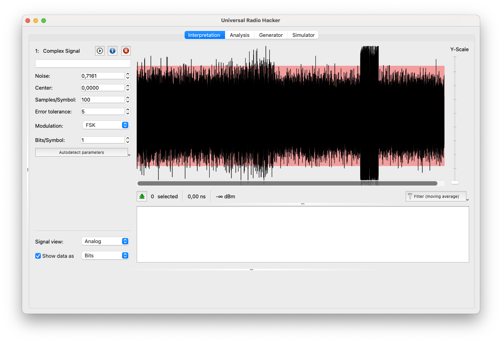

[URH](https://github.com/jopohl/urh) is another great tool. It allows you to analyze deeply the recorded IQ data and reverse engineer the signal.

Beware that when you import a file into URH, the extension is very important.
URH supports these formats:
- `.complex` for float32 I and float32 Q
- `.complex16u` for unsigned 8bit I and unsigned 8bit Q
- `.complex16s` for signed 8bit I and signed 8bit Q
- `.wav` for PCM audio

A comprehensive list of supported file formats is also given by rtl_433 itself at [this link](https://github.com/merbanan/rtl_433/blob/7676656f6daebdc1009127a80e958c524aa28105/docs/IQ_FORMATS.md) (Spoiler: cu8 is the same as complex16u)

(see more about URH in the [URH user guide](files/userguide.pdf))

Since `rtl_sdr` and `rtl_433` produce uint8 interleaved IQ files, you can import the recorded signal into URH simply by using the `.complex16u` or `.cu8` extensions.

# 4. Analyze the signal

## 4.1. Isolate the signal

The very first things to do in URH is to only analyze the signal of interest, so you need to isolate it from the rest of the recorded data.
By doing so, every step afterwards will be much easier.

Go to "Signal view" -> "Spectrogram" to visualize the signal in the frequency domain.

Here you can play with FFT window size:
- If very small, the time domain resolution will be very high, but the frequency domain resolution will be very low. (note how many yellow rectangles you can see in the spectrogram in the horizontal direction)
  

- If very large, the time domain resolution will be very low, but the frequency domain resolution will be very high. (note how many different frequencies you can see in the spectrogram in the vertical direction: it seems a completely different signal, but it's the same one as before!)
  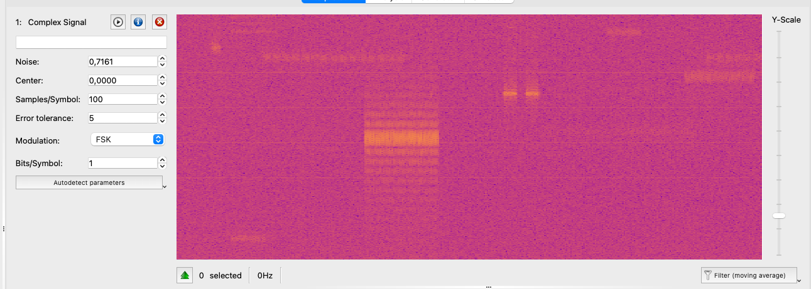

For isolating the signal frequencies a large FFT window size is what we need.

After finding your signal by playing with the FFT window size, you can isolate it by selecting your signal, right-clicking on it, and choosing "Apply bandpass filter".

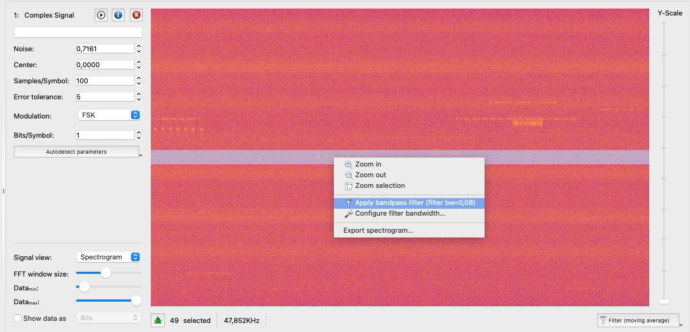

This will create a new signal that contains only the frequencies of interest, making it easier to analyze.

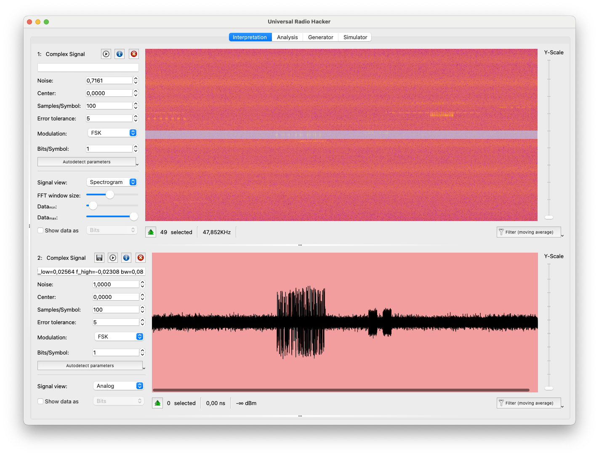

You can repeat this process with different filter parameters (using narrower bandpass filters if you have multiple frequencies near each other) until you can clearly see only the signal of interest in the spectrogram and also in the time domain view.

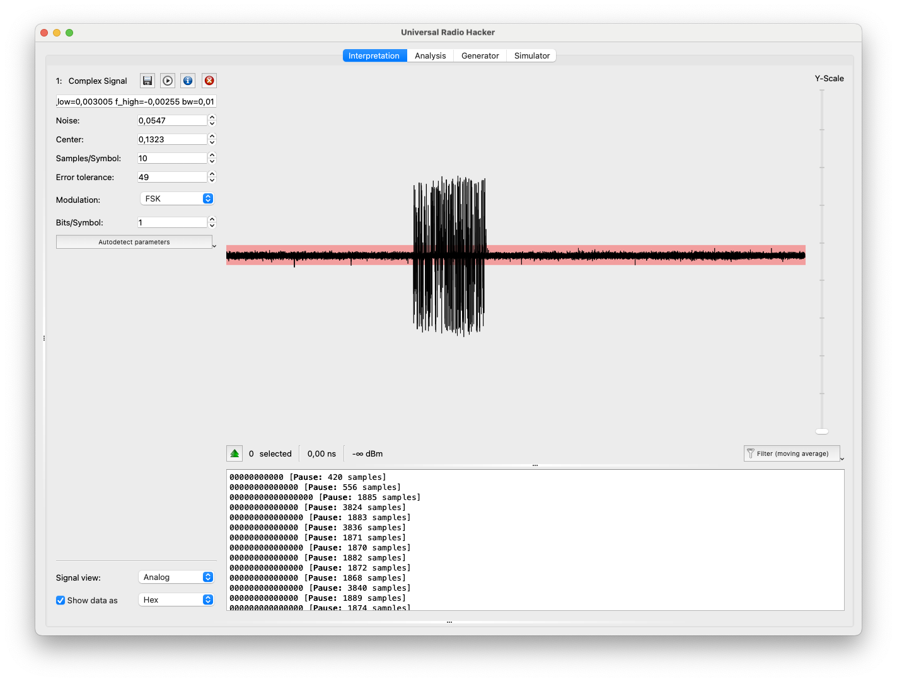

## 4.2. Reduce the noise

URH allows you to leverage the "Noise" parameter to ignore every signal below a certain threshold (the red rectangular line in the time domain view).

You must play with this parameter to find the best value that ignores the noise while keeping the red rectangular line below the signal of interest.

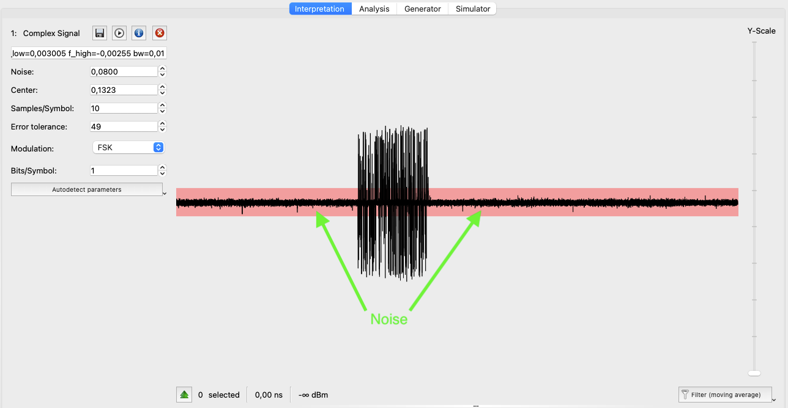

## 4.3. Demodulate the signal: choosing the modulation type

Now you have many different options to choose from to demodulate the signal.
URH supports:
- ASK (so also OOK)
- FSK
- PSK

### 4.3.1. OOK

OOK is very easy to visually recognize in the waterfall: you will see a clear on-off keying pattern, where the signal is either present (high) or absent (low), like if it was a morse code signal. The example already seen (shown also below) is a perfect example of OOK.

OOK can be demodulated by selecting ASK in URH, since OOK is a special case of ASK where the amplitude is always at the same level.

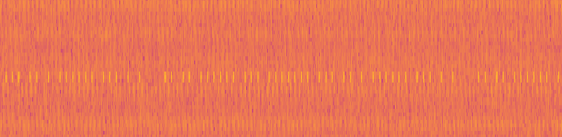

### 4.3.2. ASK

ASK is very similar to OOK, but the number of signals is not limited to just "off" and "on". In fact, ASK has different levels of amplitude, which can be used to encode more than just binary data.

To recognize ASK, you can look at the frequency domain (the waterfall) where you will see a signal around a single frequency that increases and decreases in amplitude.

See the example from [hackaday](https://hackaday.com/2020/01/28/rf-modulation-crash-course-for-hackers/) comparing ASK (on the left) with OOK (on the right):

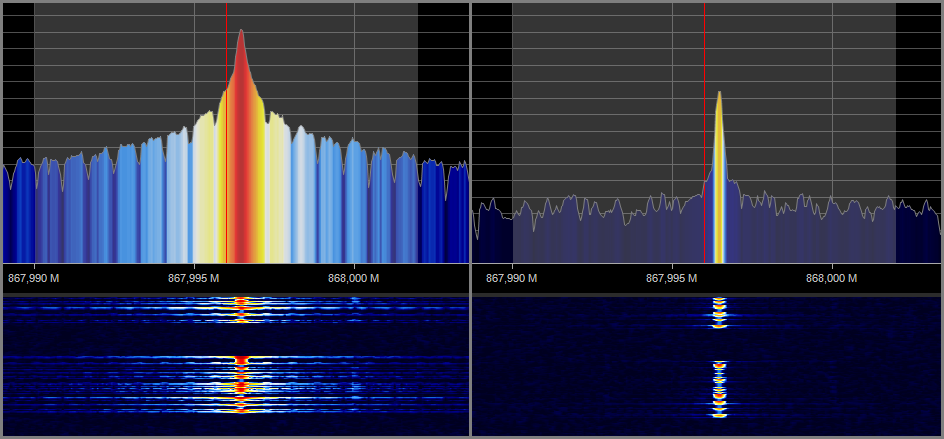

### 4.3.3. (G)FSK

FSK (Frequency Shift Keying) encodes data by switching between N frequencies. The most common implementation is 2-FSK (also called BFSK), which alternates between two frequencies to represent binary 0s and 1s.

FSK signals are easily recognizable by looking in the frequency domain, since you will see the signal jumping between two (or more) distinct frequencies.

Since FSK is very spiky in the frequency domain, often the Gaussian variant of FSK (GFSK) is used instead, which smooths the transitions between frequencies, reducing bandwidth and minimizing interference.

The visual difference between FSK and GFSK is that GFSK has smoother transitions between frequencies, while FSK has more abrupt changes. However, in practice, FSK and GFSK can be treated very similarly for demodulation purposes, so you don't need to worry too much about distinguishing between them.

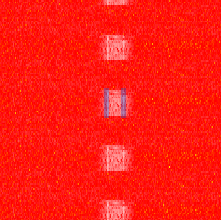

In the example above, I highlighted in blue the two frequencies used by the 2-GFSK signal. The signal pattern repeats multiple times, making the frequency switching behavior easier to observe.

### 4.3.4. PSK

I've not yet encountered a PSK signal, so I will need to do more research on this topic. :)

## 4.3. Demodulate the signal: parameters

Once you have chosen the modulation type, you can start demodulating the signal by playing with the parameters.

The most important one is the "Sample/Symbol" parameter, which defines how many samples are used to represent a single symbol (bit).

Given the sampling rate `Fs` and the baud rate `Rb`, then `sps` can be calculated as:

```
sps = Fs / Rb
```

So if you are sampling at 2.4MHz and you know the baud rate is 4.8Kbps, then the Sample/Symbol is:

```
sps = 2,400,000 / 4,800 = 500
```

If you don't know the baud rate, you must proceed with trial and error, that can be frustrating at the beginning.
A "guided" trial and error however can be done in URH with the following tips:

- Try the autodetect feature in URH, that can give you a good starting point
- Try to imagine what protocol can be used by the device you are trying to reverse engineer, and look for its baud rate online

And of course use the "Demodulated" view! Even if it sounds like you are not achieving anything (see screenshot below)

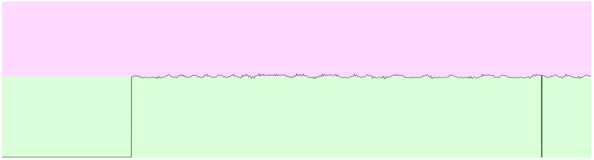

maybe it's just because you need to zoom in a little bit more...

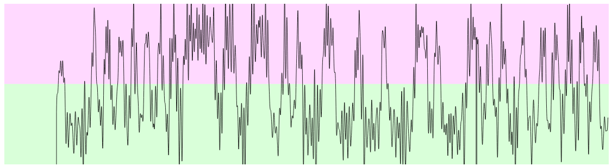

Also always remember you can select a portion of the signal and see the corresponding demodulated bits only for that portion and viceversa.

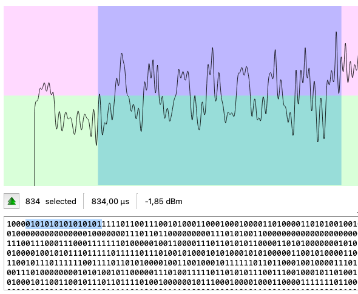
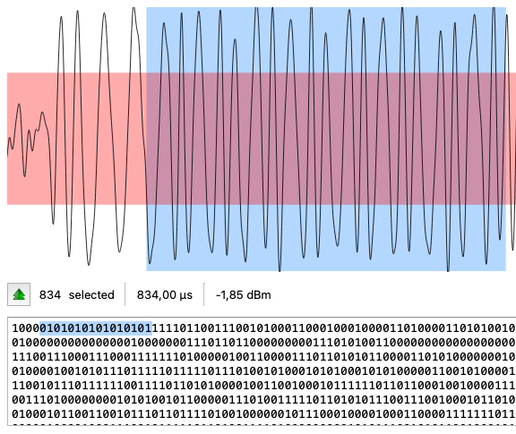

## 4.4. Decoding the signal

Once the demodulation seems good enough, you can proceed to decode the signal. In the reality you will likely need to go back and forth between demodulation and decoding multiple times until you get a good result.

Decoding the signal involves finding the right frame structure, preamble, sync word, and encoding scheme used by the protocol.
Without at least a vague idea on the protocol, it is just a matter of guessing.

Below you can see an example of a successfully demodulated and decoded Wireless-MBus Mode N signal.

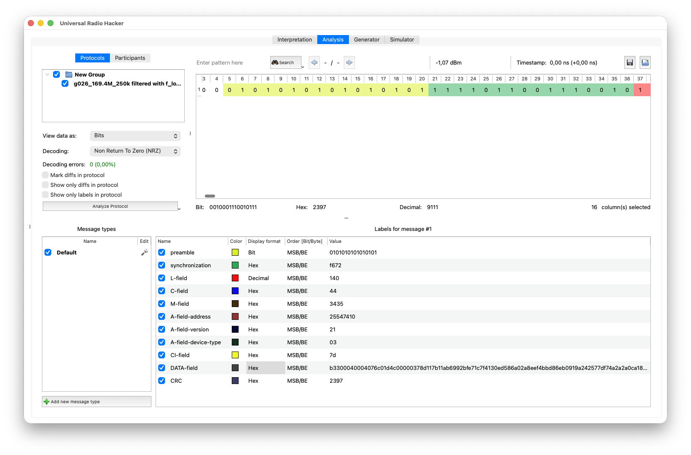


# Conclusions

That's it for now! I hope this page will help at least someone to get started with reverse engineering digital radio signals using SDR.
