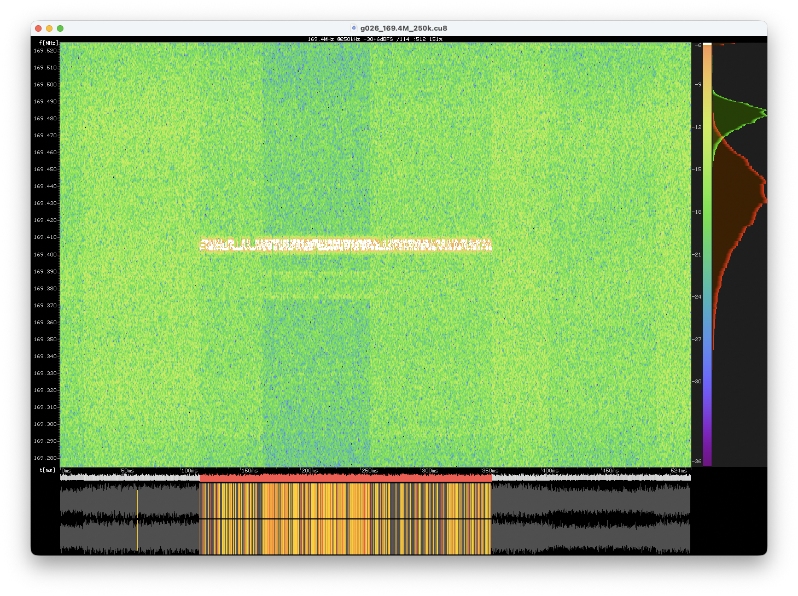
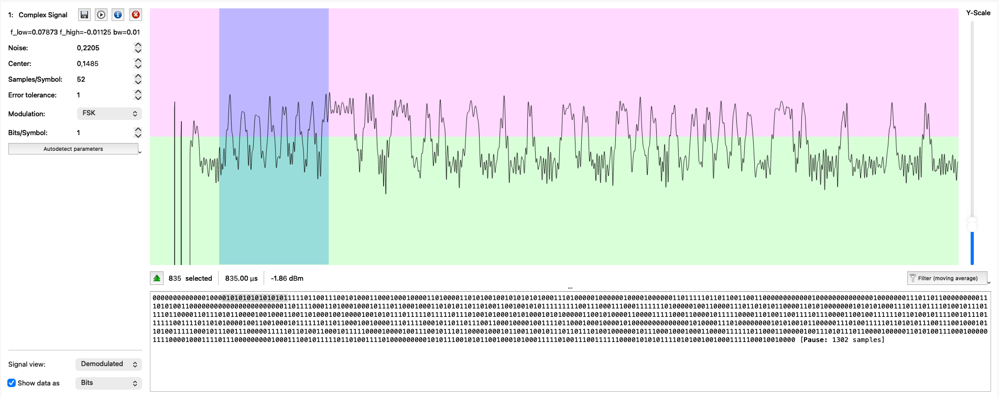
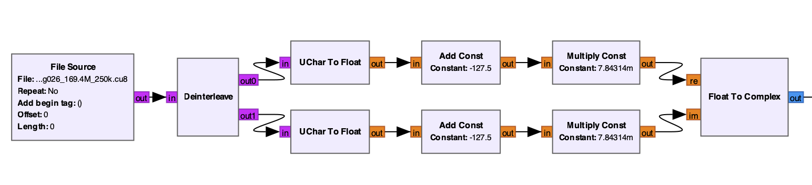
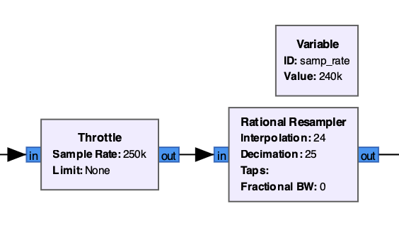
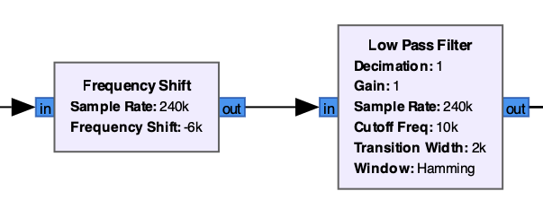
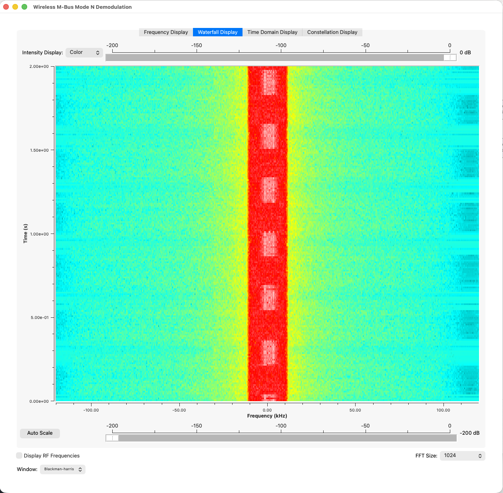
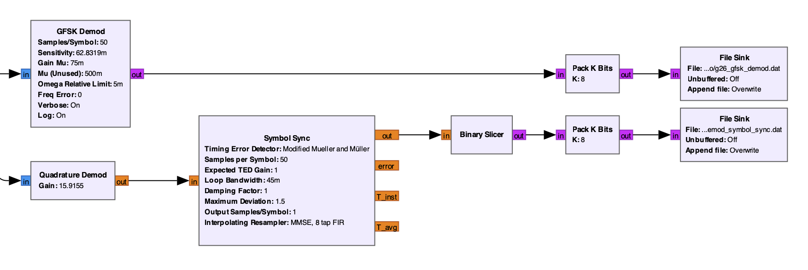
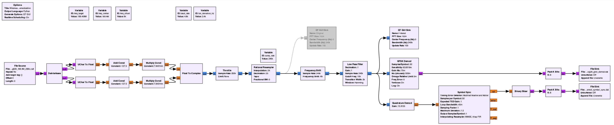

# Introduction

My journey started with simple SDR experiments with [Reverse engineering a digital radio signal](../006-sdr-pipeline/), but I wanted more.

I wanted to be able to decode real-world signals! So I stood up from my chair and started looking around my house.

Soon I found two interesting items:

1. The gas meter, which has a pretty nice label with `169MHz` written on it.



2. The heat allocators on the radiators, which are not labeled with a frequency, but must communicate somehow, so I guess they also use radio signals.



Although I really wanted to go straight to the radio signals, I decided to approach them step by step, so I started searching for documentation.

# Wireless M-Bus

## Starting point

As soon as I started researching, I found out that most of the meters in the world (and especially in Europe) use a protocol called Wireless M-Bus (or WMBus) to communicate their readings.

Wireless M-Bus is a wireless extension of the already existing M-Bus (Meter-Bus) protocol, which is a European standard (EN 13757-2 and EN 13757-3) for reading water, gas, heat, and electricity meters using a wired connection.

But where should I start? I needed a real signal to analyze. I tried to capture some signals with my RTL-SDR, but I had no idea what to look for, and so I eventually gave up.

Instead, after digging deeper into the internet, I discovered several useful resources.

First of all I discovered that:


⚠️ **Wireless M-Bus** is a complex protocol with many modes. According to the specification [EN-13757-4](files/EN%2013757-4.pdf), Wireless M-Bus defines several modes (S, T, R2, C, N, F). The most supported ones are S, T and C.


I needed **Mode N**, because it is the only one used for the 169MHz frequency band.

## Useful resources

First of all, the classic [rtl_433](https://github.com/merbanan/rtl_433) has partial Wireless M-Bus support. However, it only supports a few modes, and mode N is not one of them.

Then I stumbled upon [rtl_wmbus](https://github.com/xaelsouth/rtl-wmbus), a tool specifically designed to decode Wireless M-Bus signals captured with RTL-SDR or RTL433. However, again, it only supported a few modes, and mode N was not one of them.

However, I found a particularly interesting GitHub issue in that repository, where contributors were discussing adding Wireless M-Bus Mode N support.

The interesting part was that [@optiluca](https://github.com/optiluca) had already [uploaded some sample captures](https://github.com/xaelsouth/rtl-wmbus/issues/26#issuecomment-1357343519) of Wireless M-Bus signals and had given the link to download those captures!

As such, I downloaded the sample captures right away and started analyzing them.

# Analyzing the captures

Even though the captures were not recorded by me, they were still a great starting point.

I already had the [I/Q Quicklook](https://github.com/triq-org/iqspectrogram-quicklook) by [triq.org](https://triq.org) installed, so I chose a nice looking capture by looking at the waterfall, and opened it.



You can clearly see that the signal oscillates between two frequencies, which is a strong hint that the modulation used is Frequency Shift Keying (FSK), in this case 2-FSK.

## URH

I loaded the capture in URH, set the modulation, and started decoding the signal.



I started manually decoding the bits in a simple file, but after an enormous amount of effort (weeks passed) I was not satisfied with the manual decoding; there clearly were strange values for simple fields: I was struggling a lot.

So I started experimenting with other tools. In particular, with GNU Radio.

## GNU Radio

Building a GNU Radio flowgraph was insane to me; I had never experienced such frustration before.
Luckily for me, nowadays LLMs are available, so I used one to help me build the flowgraph. Of course it hallucinated many times, but at least it gave me a starting point.

So, first of all, I built a simple flowgraph to convert the .cu8 file to a complex signal:



Then, I just added some normalization to help me with the playground. The throttle block allowed me to slow down the playback speed so that I could visualize parts of the signal more easily when I needed to. The resampling was just to use a sample rate that was a multiple of the baud rate.



Then, I centered the signal around 0 and applied a low-pass filter to remove the noise:



And confirmed that the result was good with a QT GUI Sink block:



After that I tried and retried a lot. I think I created and deleted hundreds of blocks just to finally arrive at a working flowgraph.
Then, finally, I kept two different working flowgraphs, that I can tweak in similar but different ways.

The first one is simpler; it just uses a built-in GFSK Demod block. The second one uses a Quadrature Demod block followed by a Symbol Sync block and a Binary Slicer block. Both do the same thing, but in different ways: the GFSK Demod block sensitivity (`2 * math.pi * fsk_deviation_hz / samp_rate`) is the inverse of the Quadrature Demod gain (`samp_rate / (2*math.pi*fsk_deviation_hz)`).



Here is the full flowgraph:



Downloadable here (right click, save link as): [wmbus-mode-n.grc](files/wmbus-mode-n.grc)

The flowgraph, when run, produces two files that should contain almost the same bitstream.

To decode Wireless M-Bus frames from the bitstream, I used a simple Python script, that you can find below:


```python
# decode-wmbus.py
from struct import unpack

def crc16_en13757_bytes(data):
  POLY   = 0x3D65
  INIT   = 0x0000
  XOROUT = 0xFFFF

  crc = INIT
  for byte in data:
    for i in range(8):
      bit = (byte >> (7 - i)) & 1
      c15 = (crc >> 15) & 1
      crc = ((crc << 1) & 0xFFFF)
      if c15 ^ bit:
        crc ^= POLY
  return crc ^ XOROUT

files = [
  'g26_gfsk_demod.dat',
  'g26_quad_demod_symbol_sync.dat'
]

for f in files:
  print(f"\n\nFile: {f}")
  # Original bits array from file
  o_bits = [(byte >> (7 - i)) & 1 for byte in open(f, 'rb').read() for i in range(8)]

  # Search for preamble and sync
  preambles_indices = []
  preamble = [0,1]*8
  sync1 = [1,1,1,1,0,1,1,0]
  preamble_plus_sync1 = preamble + sync1

  for i in range(len(o_bits) - len(preamble_plus_sync1)):
    if o_bits[i:i+len(preamble_plus_sync1)] == preamble_plus_sync1:
      preambles_indices.append(i)
      print(f"Preamble found at bit position: {i}")

  print(f"Total preambles found: {len(preambles_indices)}")

  if not preambles_indices:
    print("No preamble found.")
    continue

  for preamble_index in preambles_indices:
    # Re-align data to preamble_index % 8
    aligned_bits = o_bits[preamble_index:]
    data = bytes(
      sum(bit << (7 - i) for i, bit in enumerate(chunk))
      for chunk in [aligned_bits[i:i+8] for i in range(0, len(aligned_bits), 8)]
      if len(chunk) == 8
    )

    print(f"Realigned data (length {len(data)} bytes): {data.hex()}")

    # L1 sync
    preamble = unpack('>H', data[0:2])[0]
    sync = unpack('>H', data[2:4])[0]

    # L2 fields
    L_field = unpack('>B', data[4:5])[0]
    C_field = unpack('>B', data[5:6])[0]
    M_field = unpack('>H', data[6:8])[0]
    A1_field = unpack('>I', data[8:12])[0]
    A2_field = unpack('>H', data[12:14])[0]

    # decode M field
    alphabet = "_ABCDEFGHIJKLMNOPQRSTUVWXYZ+-*/"
    M_third_letter = alphabet[(M_field & 0b11111)]
    M_second_letter = alphabet[(M_field >> 5) & 0b11111]
    M_first_letter = alphabet[(M_field >> 10) & 0b11111]
    M_top_bit = (M_field >> 15) & 0b1

    # decode A field
    A_device_type = A2_field & 0xFF
    A_version = (A2_field >> 8) & 0xFF
    A_id = A1_field

    print(f"At preamble index {preamble_index}:")
    print(f"  Preamble: 0x{preamble:04X}")
    print(f"  Sync: 0x{sync:02X}")
    print(f"  L field: 0x{L_field:02X} (length = {L_field} bytes)")
    print(f"  C field: 0x{C_field:02X}")
    print(f"  M field: 0x{M_field:04X} ({M_first_letter}{M_second_letter}{M_third_letter}, top bit: {M_top_bit})")
    print(f"  A field: 0x{A1_field:08X}{A2_field:04X} (ID: 0x{A_id:04X}, Version: 0x{A_version:02X}, Device Type: 0x{A_device_type:02X})")
    print()

    format = None
    if sync == 0b11110110_10001101:
      format = "A"
    elif sync == 0b11110110_01110010:
      format = "B"
    else:
      print(f"Unknown mode/format {sync:04X}")
      continue

    L7_data = bytes()

    print(f"Mode N, Format {format}")

    if format == "A":
      CRC_field = unpack('>H', data[14:16])[0]
      actual_crc = crc16_en13757_bytes(data[4:14])
      print(f"  CRC field: 0x{CRC_field:04X}")
      if actual_crc == CRC_field:
        print(f"  CRC valid: 0x{CRC_field:04X}")
      else:
        print("  " + "-"*8 + f"> CRC invalid! Computed: 0x{actual_crc:04X}, Expected: 0x{CRC_field:04X}")
      # ...
      # TODO
      # ...
    elif format == "B":
      CI_field = unpack('>B', data[14:15])[0]
      print(f"  CI field: {CI_field:02X}")

      length = min(128, L_field) - 13
      print(f"  DATA field length: {length} bytes")

      DATA_field = data[15:15+length]
      L7_data += DATA_field
      CRC_field = unpack('>H', data[15+length:15+length+2])[0]
      actual_crc = crc16_en13757_bytes(data[4:15+length])

      print(f"  DATA field: {DATA_field.hex()}")
      if actual_crc == CRC_field:
        print(f"  CRC valid: 0x{CRC_field:04X}")
      else:
        print("  " + "-"*8 + f"> CRC invalid! Computed: 0x{actual_crc:04X}, Expected: 0x{CRC_field:04X} <" + "-"*8)

      # If L_field is greater than 128, then there is another optional frame
      if L_field > length:
        OPT_DATA_field = data[15+length+2:15+length+2+L_field-129]
        L7_data += OPT_DATA_field
        OPT_CRC_field = unpack('>H', data[15+length+2+L_field-129:15+length+2+L_field-129+2])[0]
        actual_opt_crc = crc16_en13757_bytes(OPT_DATA_field)
        print(f"  OPT DATA field: {OPT_DATA_field.hex()}")
        if actual_opt_crc == OPT_CRC_field:
          print(f"  OPT CRC valid: 0x{OPT_CRC_field:04X}")
        else:
          print("  " + "-"*8 + f"> OPT CRC invalid! Computed: 0x{actual_opt_crc:04X}, Expected: 0x{OPT_CRC_field:04X} <" + "-"*8)

    print(f"\nLayer 7 data: {L7_data.hex()}")
```

&nbsp;

This script allowed me to programmatically decode the bitstreams into the following (I stripped one of the two almost identical outputs for brevity):

```
Preamble found at bit position: 563
Total preambles found: 1
Realigned data (length 243 bytes): 5555f6728c4434352554741021037db33000800101db00753000001bc688bb11ab6992bfe71c7f4130ed586a02a8eef4bbd86eb0919a242577df74a2a2a0ca187c617c34cf70c9fb4bcbbf3da84c8bf6c48778b6e6213d8885020143a0152c1d3ed5ce45a7c5ce0fb4c5f084e5d8459976e902e2230fd8c13aec20d4e20f08f7022397da7a00ae56451f4e7e157a923e241007e535b071678cc024d505a2a1135bd95326c7f0023584579cd8147359db8996218f38e8258f9ee098dcb8850ec982a25491e404b1e4e915af725c0514513c50d7749d4ba117caa0bb70183209a51ec8134decafeb8498630c06ce686f8949e633
At preamble index 563:
  Preamble: 0x5555
  Sync: 0xF672
  L field: 0x8C (length = 140 bytes)
  C field: 0x44
  M field: 0x3435 (MAU, top bit: 0)
  A field: 0x255474102103 (ID: 0x25547410, Version: 0x21, Device Type: 0x03)

Mode N, Format B
  CI field: 7D
  DATA field length: 115 bytes
  DATA field: b33000800101db00753000001bc688bb11ab6992bfe71c7f4130ed586a02a8eef4bbd86eb0919a242577df74a2a2a0ca187c617c34cf70c9fb4bcbbf3da84c8bf6c48778b6e6213d8885020143a0152c1d3ed5ce45a7c5ce0fb4c5f084e5d8459976e902e2230fd8c13aec20d4e20f08f70223
  CRC valid: 0x97DA
  OPT DATA field: 7a00ae56451f4e7e157a92
  OPT CRC valid: 0x3E24

Layer 7 data: b33000800101db00753000001bc688bb11ab6992bfe71c7f4130ed586a02a8eef4bbd86eb0919a242577df74a2a2a0ca187c617c34cf70c9fb4bcbbf3da84c8bf6c48778b6e6213d8885020143a0152c1d3ed5ce45a7c5ce0fb4c5f084e5d8459976e902e2230fd8c13aec20d4e20f08f702237a00ae56451f4e7e157a92
```

And with that, I was finally able to decode Wireless M-Bus Mode N signals!

Interpreting the Layer 7 data is another story, but at least I managed to get this far.
